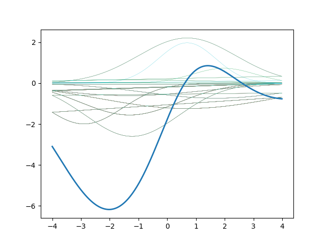

# RBF based aproximation

## Introduction
Celem zadania była implementacja radialnej sieci neuronowej opartej na aproksymacji zbioru wejściowych danych.
Zrealizowaliśmy projekt  z wykorzystaniem aproksymacji oraz osobnej nauki dwóch warstw.

## Technologies
* Python 3.6
* Radial basis fucntions
## Libraries
* math
* matplotlib
* pandas

## Usage
To run project just start main.py script

```
$ python src/main.py
```
## Demo

Aproximation with declared variables and 10 neurons, 100 iterations and second data set.<br/><br/>
 
